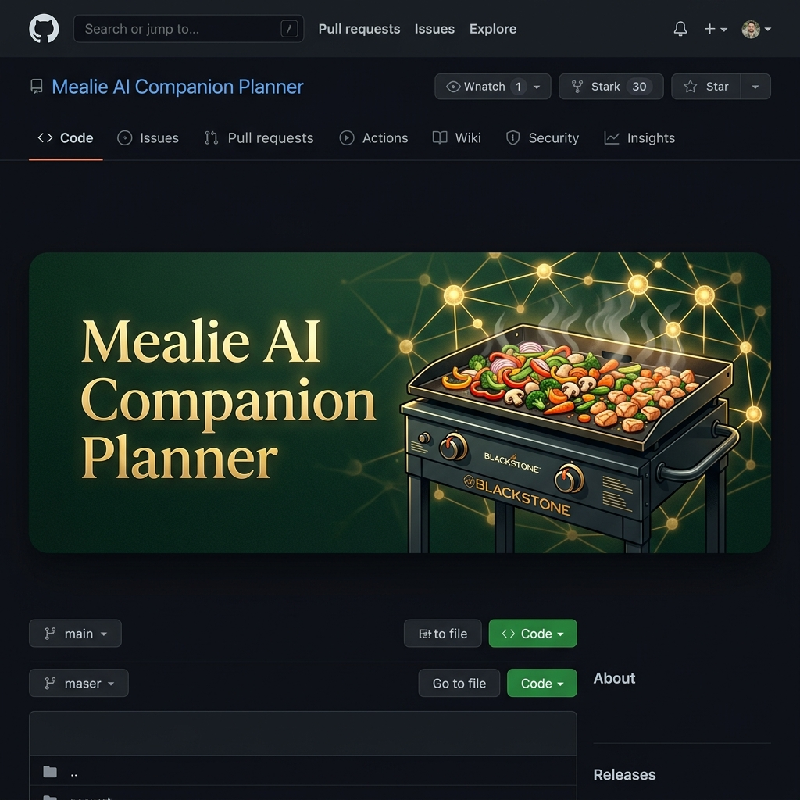

<p align="center">
  
</p>

# Mealie AI Companion Planner 🍽️

An intelligent, AI-powered weekly menu planner, shopping list syncer, and email briefing companion for **[Mealie](https://mealie.io)**.

This companion app interfaces with your Mealie instance to automate weekly menu curation, sequence meals by ingredient perishability, run Blackstone griddle compatibility checks, sync shopping lists, and send automated kitchen briefings. It also features an interactive AI chatbot for on-the-fly plan adjustments.

---

## 🚀 Quick Start

Get up and running in two simple steps:

### 1. Run the Setup Script
Run the interactive setup script to configure your environment variables (`.env`) and initialize the required Mealie MCP submodule:
```bash
python setup.py
```
*Note: If you want to skip prompts and use default settings, run `python setup.py --auto`.*

### 2. Launch with Docker Compose
Start the app and its background workers:
```bash
docker compose up -d --build
```
The planner dashboard will be accessible at **`http://localhost:9926`**.

---

## 🌟 Key Features

* **Intelligent Weekly Planning:** Schedules plans for a Saturday-to-Friday week. Sequences meals by perishability (fresh fish/greens first; frozen/pantry later) and prioritizes inventory you already have.
* **Semantic Blackstone Griddle Check:** Analyzes recipes for outdoor griddle compatibility, tags them on the dashboard, and suggests batch-cooking optimizations.
* **Active Shopping List Syncer:** Automatically syncs ingredients, cleans names, filters staples, and pushes to Mealie. Prevents item duplication by using database UUID mapping.
* **Interactive AI Chatbot:** Adjust the weekly plan dynamically ("swap Thursday's dinner with a beef recipe") using the chat panel.
* **Smart Swaps:** Suggests alternative recipes from your collection that reuse unused ingredients to minimize food waste.
* **Automated Email Briefings:** Sends weekly menus on Saturdays and daily reminders with prep steps and macro/micro nutrition tracking.
* **Progressive Web App (PWA):** Fully installable on iOS and Android devices.

---

## ⚙️ Configuration & Customization

All configurations are managed in your `.env` file, which is created automatically by the setup script.

> [!TIP]
> **Docker Networking:** If this companion app runs on the same host as Mealie and you prefer internal container-to-container routing, uncomment the network block at the bottom of `docker-compose.yml` to join Mealie's Docker network.

### Custom Household Rules
To keep your private family preferences out of git, the app loads dietary constraints and banned recipes dynamically from files in the `data/` directory (which is gitignored). 

Templates for these files are provided in the repository root and are copied automatically to the `data/` folder when you run the setup script:

1. **Custom Dietary Rules (`data/dietary_rules.txt`):**
   Define specific family guidelines, dietary styles, or severe allergies (copied from `dietary_rules.example.txt`).
2. **Banned Recipes (`data/banned_recipes.txt`):**
   List recipe titles (one per line) that the menu generator should never schedule (copied from `banned_recipes.example.txt`).

---

## 🛠️ Tech Stack

* **Backend:** Python 3.12, Flask, APScheduler
* **Frontend:** Vanilla JS, CSS (modern design tokens, responsive layout)
* **AI Engine:** Google Gemini, OpenAI, or DeepSeek API (configurable via `.env`)
* **MCP Integration:** [mealie-mcp-server](https://github.com/rldiao/mealie-mcp-server)

---

## 📜 Helper Scripts

The project includes CLI utilities in the `scripts/` directory. Run them from the project root:

```bash
# View upcoming meal plans
python -m scripts.list_plans

# Check active ingredients in the shopping list
python -m scripts.check_current_ingredients

# Wipe current plans and shopping list
python -m scripts.clear_mealie
```
*See [scripts/README.md](scripts/README.md) for the full CLI utility list.*

---

## 🧪 Running Tests

Verify your setup by running the offline mocked test suite:
```bash
pip install -r requirements.txt
pytest
```

---

## 📄 License

MIT
